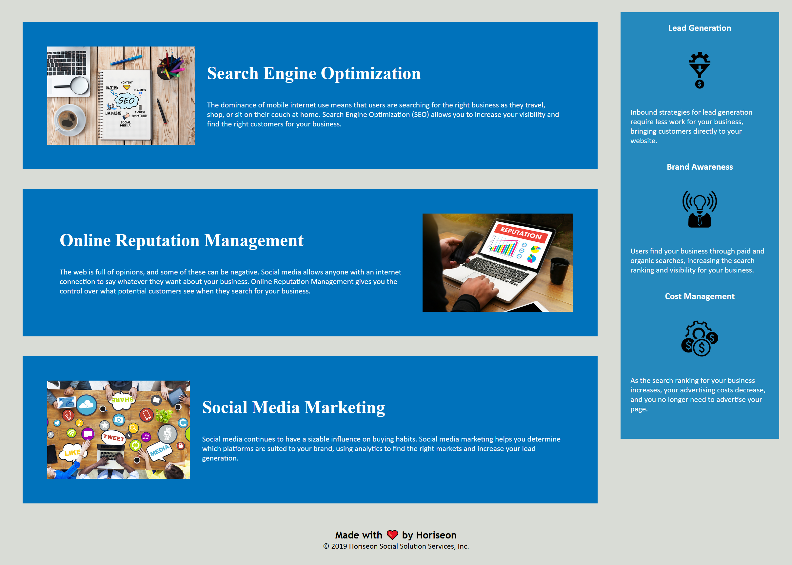

# Challenge 01

## Description

In this challenge I was tasked with refractoring a webpage for accessability. This page has a header with 3 navigation tabs and 2 of them link to the according area of the site. The css code is more consolidated and uses flex boxes to better format the elemnts on the site.

### URL

https://bluskreen.github.io/challenge01/

